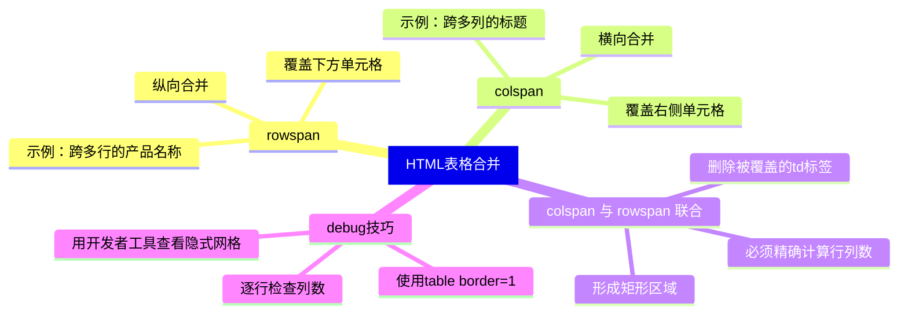

# HTML 基础标签与表格合并单元格实战指南

今天我们从一份学习笔记出发，系统梳理 HTML 中几个最常用的基础标签，并深入探讨 `<table>` 标签中 `rowspan` 和 `colspan` 的核心用法。无论你是刚接触前端的新手，还是想夯实基础的老手，理解表格合并机制都能显著提升你对 HTML 布局的掌控力——尤其是在复杂数据报表、日程表、产品规格表等场景中。本文将从基础标签开始，逐步深入表格合并原理、常见陷阱以及最佳实践，帮助你写出更健壮、更语义化的 HTML。

## 常用基础标签回顾

| 标签 | 作用 | 特点 |
|------|------|------|
| `<p>` | 定义段落 | 自动在前后添加垂直间距（margin），默认块级元素，占满整行 |
| `<span>` | 行内容器 | 默认行内元素，不换行，只在需要时包裹文本或小范围样式 |
| `<a>` | 超链接 | `href` 属性指定链接地址，`target="_blank"` 可新开窗口 |
| `` | 嵌入图片 | 自闭合标签，`src` 指定路径，`alt` 提供替代文本（无障碍与 SEO 友好） |

> **注意**：`<p>` 不能嵌套块级元素（如 `<div>`），而 `<span>` 可以包含行内元素和文本，但不应包含块级元素。

## 深入 `<table>` 标签

### 基本结构

```html
<table>
  <tr>      <!-- 行 -->
    <td>单元格1</td>
    <td>单元格2</td>
  </tr>
  <tr>
    <td>单元格3</td>
    <td>单元格4</td>
  </tr>
</table>
```

- `<table>` 为表格容器
- `<tr>` (table row) 定义一行
- `<td>` (table data) 定义单元格

### `rowspan` 与 `colspan`：合并单元格的灵魂

用户笔记中提到“一般写在 `<td>` 上”，确实如此。更准确地说，`rowspan` 和 `colspan` 是 `<td>` 或 `<th>` 的属性，用来让一个单元格跨越多行或多列。

#### 属性含义

```html
<td rowspan="2" colspan="3">合并6个单元格</td>
```

- **rowspan**：单元格纵向占据的行数，默认 1。`rowspan="2"` 表示该单元格占 2 行，其下方（或上方）相应位置的单元格会被“挤掉”。
- **colspan**：单元格横向占据的列数，默认 1。`colspan="3"` 表示该单元格横跨 3 列。

> **注意**：合并后的单元格会“覆盖”后续本该出现的单元格，所以在设计表格时要先画出网格结构，再决定合并方向。

#### 典型示例：复杂表头

```html
<table border="1">
  <tr>
    <th colspan="2">个人信息</th>
    <th colspan="2">联系方式</th>
  </tr>
  <tr>
    <td>姓名</td>
    <td>年龄</td>
    <td>电话</td>
    <td>邮箱</td>
  </tr>
  <tr>
    <td rowspan="2">张三</td>
    <td>25</td>
    <td>138xxx</td>
    <td>zhang@example.com</td>
  </tr>
  <tr>
    <!-- 第一列 rowspan="2" 已占据，此处 <td> 省略 -->
    <td>26</td>   <!-- 相当于第二列 -->
    <td>139xxx</td>
    <td>zhang2@example.com</td>
  </tr>
</table>
```

> **关键**：合并后的表格，总列数必须保持一致。例如上表每行实际有 4 列（因为有 colspan="2" 的两个表头）。

以下 Mermaid 图表展示了 `rowspan` 和 `colspan` 的合并效果：

```mermaid
graph TD
    subgraph 原始网格 4x4
        A1[1,1] --> A2[1,2] --> A3[1,3] --> A4[1,4]
        B1[2,1] --> B2[2,2] --> B3[2,3] --> B4[2,4]
        C1[3,1] --> C2[3,2] --> C3[3,3] --> C4[3,4]
    end

    subgraph 使用 rowspan=2 + colspan=3
        D1[合并后单元格<br>rowspan=2, colspan=3] --> D2[原先被覆盖的单元格删除]
        D2 --> D3[新增单元格]
    end
```

（简化示意图，实际合并需要精确计算行列数）

### 合并单元格的底层逻辑

浏览器解析表格时，会先根据所有 `<tr>` 和 `<td>` 的数量计算出一个隐式的网格。`rowspan` 和 `colspan` 会在这个网格中“扩展”单元格的尺寸，并自动调整周围单元格的位置。如果合并后的单元格与同行/同列的其他单元格冲突，浏览器会忽略多余的 `<td>`，造成表格缺少单元格，导致布局错乱。

**常见错误**：

- 忘记删除被合并覆盖的 `<td>`，导致多出一个单元格，表格总列数不一致。
- `rowspan` 跨越多行时，后续行中对应位置必须省略 `<td>`，否则会多列。
- 滥用合并导致表格语义不清，影响屏幕阅读器。

```html
<!-- 错误示例：忘记删除被覆盖的单元格 -->
<table border="1">
  <tr>
    <td rowspan="2">合并2行</td>
    <td>单元格B</td>
  </tr>
  <tr>
    <td>单元格C</td>
    <td>单元格D</td>  <!-- 此处本应只有 1 个单元格，但写了 2 个，导致多余 -->
  </tr>
</table>
```

**正确做法**：先画出网格，标记合并区域，再删除被覆盖的 `<td>`。

### 合并单元格的适用场景

1. **数据报表**：将同类数据的小标题跨列显示。
2. **日程表/课程表**：跨多行的活动。
3. **产品参数表**：跨多列的特性汇总。
4. **表单布局**：虽然不推荐用表格做布局（CSS Grid 更优），但某些传统邮件模板仍依赖表格。

以下是一个实用的产品规格表示例：

```html
<table>
  <caption>笔记本电脑配置表</caption>
  <thead>
    <tr>
      <th>项目</th>
      <th colspan="2">型号 A</th>
      <th colspan="2">型号 B</th>
    </tr>
  </thead>
  <tbody>
    <tr>
      <td rowspan="2">处理器</td>
      <td>i5</td>
      <td>2.3 GHz</td>
      <td>i7</td>
      <td>2.8 GHz</td>
    </tr>
    <tr>
      <td colspan="2">i5 高配版</td>   <!-- 跨2列 -->
      <td colspan="2">i7 顶配版</td>
    </tr>
  </tbody>
</table>
```

## 可视化知识体系



## 最佳实践与注意事项

1. **语义化优先**：尽量使用 `<th>` 作为表头，配合 `scope` 属性提升无障碍性。
2. **避免过度合并**：合并太多单元格会降低代码可读性，必要时可考虑改用嵌套表格或 CSS 布局。
3. **保持列数一致**：通过 `colspan` 合并后，每行实际列数必须相等，否则浏览器会补充空单元格或错位。
4. **CSS 替代方案**：现代布局中，`display: grid` 或 `flex` 可以实现更灵活的合并效果，但表格数据仍推荐使用 `<table>`。

## 总结

本文从 HTML 常见的基础标签（段落、行内容器、超链接、图片）出发，重点剖析了 `<table>` 中 `rowspan` 和 `colspan` 的核心语法、合并逻辑、常见错误及实际应用场景。掌握这些知识后，你将能够轻松构建清晰、规范的数 据表格，并避免因合并导致的布局混乱。记住：用表格展现数据，用 CSS 控制外观——这才是前端工程师的优雅之道。