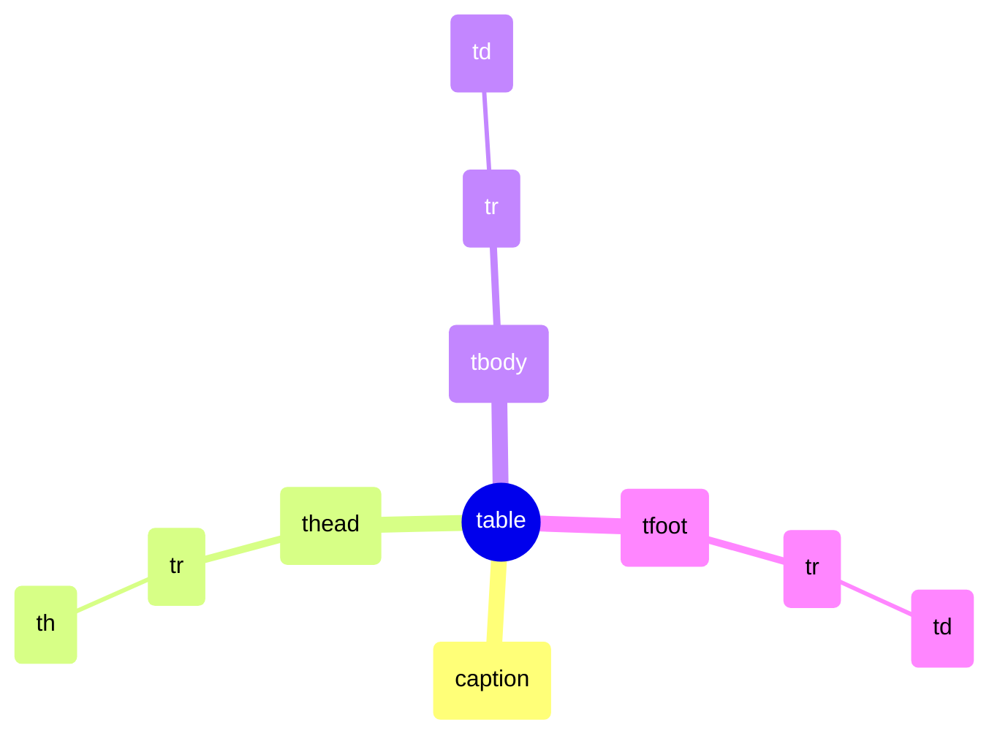

# 从基础到实战：HTML 核心标签与表格合并全解析

HTML 标签是构建网页的基石，看似简单的 `<p>`、`<span>`、`<a>`、`` 以及复杂的 `<table>` 组合，背后隐藏着丰富的语义规则与设计逻辑。今天，我们不仅复习这些基础标签的用法，更会深入剖析表格合并（`rowspan` / `colspan`）的底层原理、计算技巧以及常见陷阱。无论你是刚入门的前端新人，还是希望重固基础的老手，这篇文章都将帮你一次性吃透这些高频知识点。

## 一、基础文本与媒体标签

### 1.1 段落标签 `<p>`
`<p>` 定义了一个段落，是**块级元素**，会自动在其前后添加垂直外边距（margin），从而造成换行效果。  
**扩展点**：  
- 浏览器默认样式：通常有 `1em` 的上下 margin，可通过 CSS 重置。  
- **语义**：代表一段独立文本，不要仅为了换行而滥用 `<p>`（应使用 CSS 或 `<br>`）。  
- 内部只能包含**行内元素**（如 `<span>`、`<a>`、``），不能包含块级元素（如 `<div>`、另一个 `<p>`）。  
**最佳实践**：  
- 用 `<p>` 包裹正文段落，利于 SEO 和无障碍阅读（屏幕阅读器会识别段落边界）。  
```html
<p>这是一段话，后面会自动换行，并与其他段落保持间距。</p>
<p>第二段内容。</p>
```

### 1.2 行内标签 `<span>`
`<span>` 是最通用的**行内元素**，默认不换行，宽度仅由内容撑开。  
**使用场景**：  
- 在文本中局部应用样式（如改变颜色、字体）。  
- 包裹一小段文字用于 JavaScript 操作（例如用 `element.innerText` 动态更新）。  
**误区**：不要在 `<span>` 内嵌套块级元素，否则会导致 HTML 解析异常。  
```html
<p>这段文字中有<span style="color: red;">红色部分</span>。</p>
```

### 1.3 超链接 `<a>`
`<a>` 的核心是 `href` 属性，指向目标 URL。  
**进阶属性**：  
- `target="_blank"`：在新标签页打开，同时建议添加 `rel="noopener noreferrer"` 防止安全漏洞（window.opener 攻击）。  
- `download`：提示浏览器下载链接资源（需同源或返回正确 CORS 头）。  
- `href` 还可以是 `#id`（页面内锚点）、`mailto:email@example.com`（邮件）、`tel:+8613800138000`（电话）。  
**伪类状态**：`:link`、`:visited`、`:hover`、`:active` 需要按 LVHA 顺序声明。  
```html
<a href="https://example.com" target="_blank" rel="noopener noreferrer">安全打开新窗口</a>
<a href="#section2">跳转到本页 section2 位置</a>
```

### 1.4 图片标签 ``
`` 是自闭合行内替换元素，常用属性：  
- `src`：图片路径。  
- `alt`：替代文本，对无障碍和 SEO 至关重要（当图片加载失败时显示）。  
- `width` / `height`：建议设置，避免布局偏移（Layout Shift）。  
**高级用法**：  
- `loading="lazy"`：延迟加载图片，提升首屏性能。  
- `srcset` + `sizes`：根据屏幕分辨率提供不同尺寸图片（响应式图片）。  
```html

```

## 二、表格标签与合并单元格详解

### 2.1 表格基本结构
一个标准 `<table>` 推荐包含组织结构：  
```html
<table>
  <caption>员工工资表</caption>   <!-- 表格标题（可选） -->
  <thead>
    <tr><th>姓名</th><th>职位</th><th>月薪</th></tr>
  </thead>
  <tbody>
    <tr><td>张三</td><td>工程师</td><td>1.5 万</td></tr>
    <tr><td>李四</td><td>设计师</td><td>1.2 万</td></tr>
  </tbody>
  <tfoot>
    <tr><td colspan="3">合计：2.7 万</td></tr>
  </tfoot>
</table>
```
- `<tr>` 表示行（Table Row）  
- `<td>` 表示单元格（Table Data）  
- `<th>` 表示表头单元格（Table Header），默认加粗并居中  
- `colspan` / `rowspan` 只能写在 `<td>` 或 `<th>` 上

下图展示了表格的结构层次：


### 2.2 `rowspan`（行合并）与 `colspan`（列合并）
这是表格中最容易出错但最强大的功能。  

#### 核心定义
- **`colspan="n"`**：当前单元格向右**跨越 n 列**，即合并其右侧的 n-1 个列。  
- **`rowspan="n"`**：当前单元格向下**跨越 n 行**，即合并其下方的 n-1 行中的对应列。  

#### 计算规则
假设一个单元格声明：`<td rowspan="2" colspan="3">`  
- 它占据**2 行**（当前行 + 下一行）  
- 同时占据**3 列**（当前列 + 右侧两列）  
- 总共覆盖 **2 × 3 = 6 个单元格**的物理位置  

#### 必须注意的隐藏规则
1. **被合并的单元格必须从 HTML 中移除**。  
   例如：`<td rowspan="2">` 跨两行，那么下一行对应位置不应该再写 `<td>`（否则会多出一个单元格，导致布局错乱）。  
2. **总列数必须一致**。每行计算时，`colspan` 的值要算进该行的单元格个数中。  
3. **跨行合并后，后续行的单元格位置要依次后移**。  

#### 实战案例：复杂合并表格
我们想写出类似课程表的布局——第一行第一格跨两行三列。  

**HTML 代码**（省略 `thead` 等，仅核心）：
```html
<table border="1" style="border-collapse: collapse;">
  <tr>
    <td rowspan="2" colspan="2">合并区域（2行 x 2列）</td>
    <td>列3</td>
    <td>列4</td>
  </tr>
  <tr>
    <!-- 这里不再写第一第二列，因为被上一行 rowspan 覆盖 -->
    <td>列3</td>
    <td>列4</td>
  </tr>
  <tr>
    <td>列1</td>
    <td>列2</td>
    <td>列3</td>
    <td>列4</td>
  </tr>
</table>
```
**效果说明**：  
- 第一行有 2 个 `<td>`（一个跨 2 列 + 两个普通列），共 4 列。  
- 第二行只有 2 个 `<td>`，因为第一列和第二列已经被第一行的 `rowspan` 覆盖。  
- 第三行正常有 4 个 `<td>`。  

#### 流程图：合并单元格的思考步骤
```mermaid
graph TD
  A[开始设计表格] --> B[确定总列数]
  B --> C{需要合并吗？}
  C -->|是| D[在目标单元格添加 rowspan/colspan]
  D --> E[从后续行/列删除被覆盖的 td]
  E --> F[检查每行 sum(colspan) == 总列数]
  F -->|不等| G[调整 colspan 或增加/删除 td]
  F -->|相等| H[结束]
  C -->|否| F
```

### 2.3 常见误区与注意事项
| 误区 | 正确做法 |
|------|----------|
| 忘了删除被合并的 `<td>`，导致多余单元格 | 每行只保留未被跨越的单元格 |
| 跨行合并后下一行对应位置写了空 `<td>` | 空 `<td>` 会导致该列多出一格，应直接删除 |
| `colspan="0"` 或 `rowspan="0"` 期望自动计算 | HTML 规范中，`colspan="0"` 表示跨越到列组结束，但实际浏览器支持不稳定，建议只用正整数 |
| 合并后总列数不一致，表格变形 | 调试时打开浏览器开发者工具检查表格网格线 |

**可访问性**：使用 `scope="col"` 或 `scope="row"` 为 `<th>` 指定方向，帮助屏幕阅读器正确关联表头与数据。  
```html
<th scope="col">月薪</th>
<th scope="row">张三</th>
```

## 三、最佳实践与总结

### 3.1 什么时候用表格？
- 展示**关系型数据**（如成绩单、时间表、价格对比）。  
- 不要用于页面布局——现代布局应使用 CSS Grid 或 Flexbox。  

### 3.2 小而美的合并策略
- 先画出草稿网格，标记合并区域。  
- 按行编写，每个 `rowspan` 会在后续行“吃掉”相应位置。  
- 使用代码格式化工具确保缩进清晰，避免遗漏。  

### 3.3 与 CSS 结合的优化
- 给 `<table>` 设置 `border-collapse: collapse` 让边框合并，更干净。  
- 使用 `:nth-child` 或 CSS Grid 模拟表格效果？不，语义化优先。  

## 总结
本文从最常用的 `<p>`、`<span>`、`<a>`、`` 出发，强调了语义与高级属性，然后深入表格合并机制——`rowspan` 和 `colspan` 的核心计算、代码示例以及常见错误。记住关键点：**合并后必须删除被覆盖的单元格，并保证每行列数总和一致**。最后，通过 Mermaid 思维导图和流程图，将抽象概念可视化。掌握这些基础，你就能更自信地搭建结构化网页。